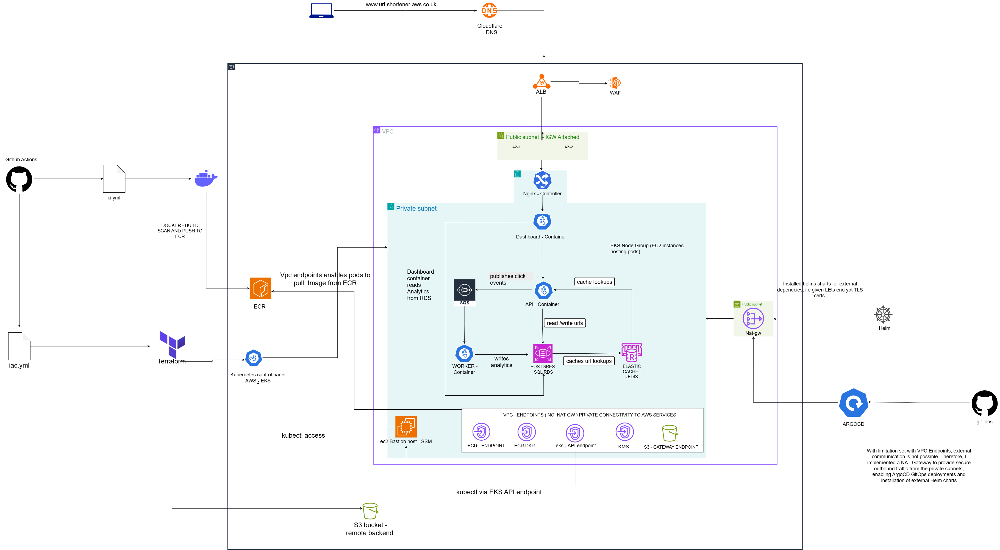

# Architecture — Multi-Service URL Shortener on EKS (Kubernetes Layer)

This document covers the Kubernetes layer mainly: workloads, Services, Ingress, Helm packaging, IRSA, observability, AWS services used by EKS provision with Terraform and GitOps.

## Traffic Route

Traffic reaches the cluster via an external ALB following this route displayed below.

```
ALB → nginx-ingress (in-cluster) → api-service / dashboard-service → Deployments
```

Everything from nginx-ingress inward is covered below.

Application architecture diagram from user to application end-to-end including CI/CD, AWS services implemented, and DNS (Cloudflare) HTTPS.



## EKS Cluster

**API Access**

| Auth Mode | API |
|---|---|
| Private + Public | Cluster access is via EKS Access Entries — alternative to aws-auth ConfigMaps |

## Kubernetes ↔ AWS Integration

Covering additional AWS resources and modifications that are required for AWS EKS to function, labeled below.

**Subnet Auto-Discovery Tags**

| Tag | Applied to | Purpose |
|---|---|---|
| `kubernetes.io/cluster/<cluster-name>=shared` | Public + private subnets | Marks subnets as usable by this cluster |
| `kubernetes.io/role/elb=1` | Public (ALB) subnets | Tells the ALB Controller to place internet-facing load balancers here |
| `kubernetes.io/role/internal-elb=1` | Private subnets | Tells the ALB Controller to place internal load balancers here |

**Control Plane ↔ Node Security Group Rules**

Additional security group rules added to enable communication between cluster and nodes.

| From | To | Port | Purpose |
|---|---|---|---|
| cluster_sg | nodes_sg | 443 | API server → kubelet (exec, logs, port-forward) |
| cluster_sg | nodes_sg | 10250 | API server → kubelet API |
| nodes_sg | nodes_sg | all | Node-to-node pod networking |

**OIDC Provider (IRSA prerequisite)**

An IAM OIDC identity provider is registered against the cluster's OIDC issuer URL. Implemented IRSA to give pods scoped IAM permissions instead of shared node IAM permissions. By registering the cluster's OIDC identity issuer with AWS IAM and then binding it to each service account, this prevents a broad blast radius if any workload is compromised.

ServiceAccounts require IRSA bindings to assume an IAM role — without the OIDC step implemented, Kubernetes workloads won't be capable of handling pod identity.

## Kubernetes Workloads

**Deployments**

| Deployment | Port | Namespace | Service Account | Config Source | Secrets | Replicas |
|---|---|---|---|---|---|---|
| API | 8080 | url-shortener | api-sa | api-config | db-secret, redis-secret | 1 |
| Dashboard | 8081 | url-shortener | dashboard-sa | dashboard-config | db-secret | 1 |
| Worker | none | url-shortener | worker-sa | worker-config | db-secret | 1 |

**Replica Sizing Rationale**

| Environment | Replicas | Reason |
|---|---|---|
| Dev | 1 | Single replica keeps pod logs simple and avoids multi-pod debugging noise |
| Staging | 1 | Focus is on validating Helm packaging, TLS, and observability — not pod-level HA |
| Prod | 2+ | Ensures HA at the pod level across nodes |

**Services**

| Service | Port | Namespace | Type | Selector |
|---|---|---|---|---|
| api-service | 8080 | url-shortener | ClusterIP | app.kubernetes.io/name=api |
| dashboard-service | 8081 | url-shortener | ClusterIP | app.kubernetes.io/name=dashboard |

**Ingress**

| Ingress | Host | TLS Secret | Paths | Service | Port |
|---|---|---|---|---|---|
| api-ingress | url-shortener-aws.co.uk | url-shortener-tls | /shorten, /stats, / | api-service | 8080 |
| dashboard-ingress | url-shortener-aws.co.uk | url-shortener-tls | /summary, /recent, /top, /url, /healthz | dashboard-service | 8081 |

**ConfigMaps**

| ConfigMap | Namespace | Keys | Purpose |
|---|---|---|---|
| worker-config | url-shortener | APP_ENV, DB_PORT, DB_HOST, SQS_URL, SQS_DLQ_URL | Worker runtime + SQS endpoints |
| api-config | url-shortener | APP_ENV, DB_HOST, DB_PORT, REDIS_HOST, REDIS_PORT | API runtime + Redis endpoints |
| dashboard-config | url-shortener | APP_ENV, DB_HOST, DB_PORT | Dashboard runtime |

**Workload Summary**

| Component | Purpose | Key Items |
|---|---|---|
| Deployments | Application workloads | API, Dashboard, Worker |
| Services | Internal service discovery | api-service (8080), dashboard-service (8081) |
| Ingress | External routing + TLS | api-ingress, dashboard-ingress |
| ConfigMaps | Non-secret configuration | api-config, dashboard-config, worker-config |
| ServiceAccounts (IRSA) | AWS IAM identity for pods | api-sa, dashboard-sa, worker-sa |

## Helm

| Component | Purpose | Files |
|---|---|---|
| Chart Metadata | Defines chart name, version, description | Chart.yaml |
| Values | Central config for all templates | values.yaml (+ values-dev.yaml, values-staging.yaml, values-prod.yaml) |
| Deployments | API, Dashboard, Worker workloads | templates/deployment.yaml |
| Services | ClusterIP services | templates/service.yaml |
| Ingress | Routing + TLS | templates/ingress.yaml |
| ConfigMaps | Runtime configuration | templates/configmap.yaml |
| ServiceAccounts | IRSA bindings | templates/serviceaccount.yaml |

No `secrets.yaml` template. Kubernetes Secrets (db-secret, redis-secret) are created directly via `kubectl create secret`. Real credential values never live in the chart or values.yaml. Templates only reference these Secrets by name via `secretKeyRef`.

**Third-Party Helm Installs**

Separate chart installs from the url-shortener app chart above — installed independently, not part of `templates/`.

| Chart | Purpose | Values file |
|---|---|---|
| ingress-nginx | Ingress controller handling in-cluster routing | helm/ingress-nginx-values.yml |
| aws-load-balancer-controller | Manages the ALB, sitting in front of ingress-nginx | (path to confirm) |
| cert-manager | TLS certificate issuance via Let's Encrypt | (path to confirm) |

## Compute

**Dev — managed node group**

| Instance Type | Scaling | Max Pods/Node |
|---|---|---|
| t3.small | desired 2 / min 1 / max 5 | 4 (ENI/IP allocation limit) |

## IRSA Bindings

| ServiceAccount | Namespace | Purpose |
|---|---|---|
| api-sa | url-shortener | API access to RDS, Redis, SQS (future) |
| dashboard-sa | url-shortener | Dashboard read-only DB access |
| worker-sa | url-shortener | Worker access to SQS + DLQ |
| aws-load-balancer-controller | kube-system | Allows the ALB Controller to create/manage the ALB, target groups, and listener rules on behalf of Ingress resources |

## Prometheus & Grafana

| Metric | Purpose | Source |
|---|---|---|
| CPU Usage | Detect node/pod saturation and pressure | kubelet / cAdvisor |
| Memory Usage | Identify OOMKills, leaks, node pressure | kubelet / cAdvisor |
| Pod Restarts | Catch CrashLoopBackOff, failing addons | kube-state-metrics |
| Node Health | Disk pressure, network pressure, readiness | node-exporter |
| DNS Latency | Detect CoreDNS overload (quiet outage risk) | CoreDNS metrics |
| Ingress Traffic | Request volume, errors, latency | ingress-nginx metrics |

## GitOps — ArgoCD

| Item | Value |
|---|---|
| Source of truth | git_ops repo (separate from the app repo) |
| Sync policy | Automated — cluster continuously reconciles to match the target Git ref |
| Target namespace | url-shortener (per environment) |
| Rollback | Via Git revert / ArgoCD UI, not manual kubectl/helm |

Eliminates manual `kubectl apply` / `helm install`/`upgrade` against Prod — Git becomes source of truth.
