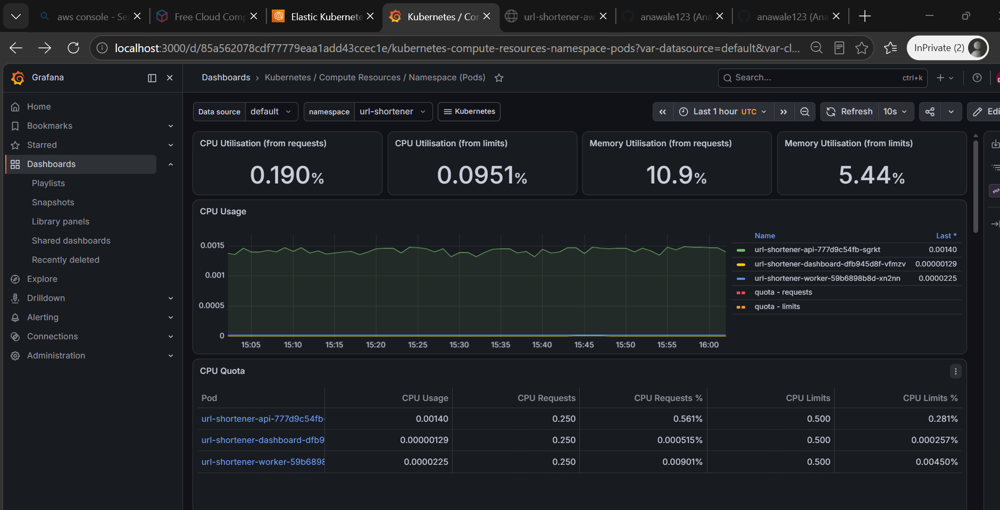
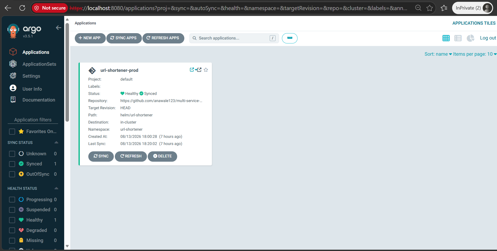

# URL-SHORTENER – EKS Multi Container Deployment

Project focuses on delivering a secure platform for a multi-service container system that lives on AWS. The system was previously deployed onto AWS ECS Fargate. The main objective of this project is to outline the conversion from AWS serverless container compute into Kubernetes workloads on AWS EKS.

## Main Features

| Feature | Description |
|---|---|
| **kubernetes** | Orchestrates containers, running the cluster on AWS EKS with EC2 instances as node groups. Attached EKS API for IAM access entries instead of the legacy aws-auth configmap for cluster access. Workloads split into distinct k8s manifests per service (deployment, service, configmap, ingress). |
| **helm** | Packages the manifests into a single versioned chart, promoting the environment in three incremental stages (dev, staging, prod). Installs external dependencies such as the nginx ingress controller, cert-manager, and observability tooling. |
| **iac** | Terraform provisions the EKS cluster, VPC, IAM roles, the OIDC provider (required for IRSA), and CloudWatch dashboards for AWS-managed services (RDS, SQS, ALB). |
| **observability** | Prometheus scrapes pod-level metrics (CPU, memory, restarts) alongside metrics exposed by cluster components like ingress-nginx; Grafana visualizes these for pod-level and cluster health monitoring. |
| **deployment** | ArgoCD manages the url-shortener namespace using Git as the single source of truth, reconciling cluster state automatically instead of relying on manual kubectl/helm commands. |

## Docs

| Document | Covers |
|---|---|
| [ARCHITECTURE.md](./ARCHITECTURE.md) | EKS/AWS infrastructure and Kubernetes Helm packaging in detail, including diagrams for the infrastructure layer and the per-container Helm setup |
| [DEPLOYMENT.md](./DEPLOYMENT.md) | The iterative phases of deployment |

## Live Demo

[Watch on YouTube](https://www.youtube.com/watch?v=JCr9sdSJwzQ)

Shows the application running live, plus kubectl commands for pods and logs.

## Observability

Pod-level scoped observability via Prometheus and Grafana, scoped to the `url-shortener` namespace.

## GitOps

ArgoCD uses the Helm chart path in Git as the source of truth, synced live with self-healing enabled.

